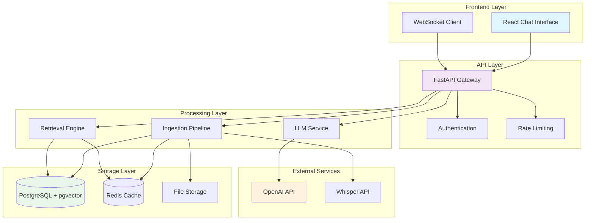
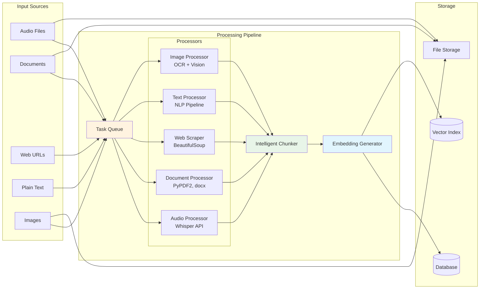
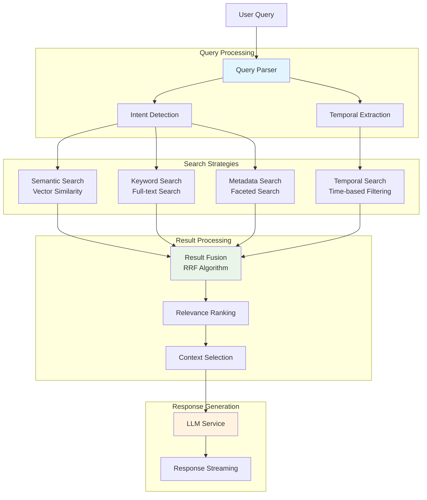
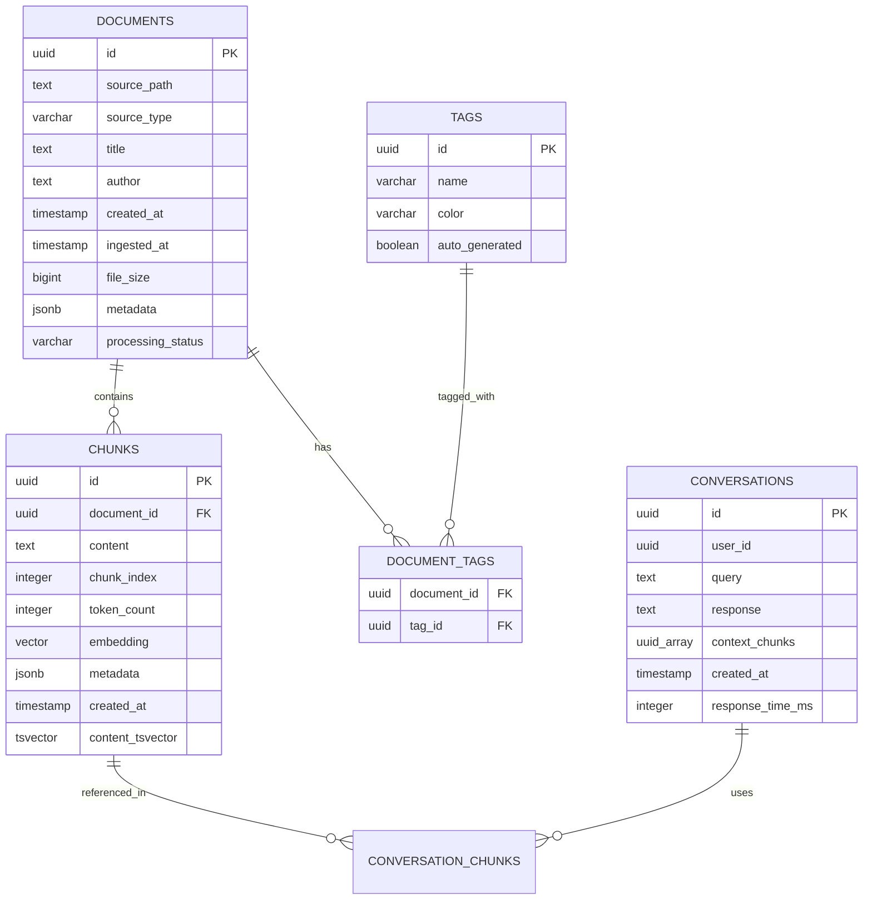
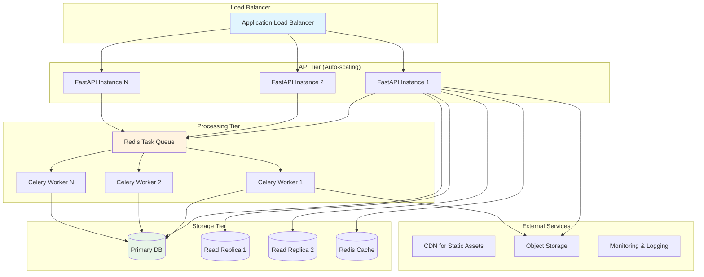

# Architecture Diagrams

## 1. High-Level System Architecture



## 2. Data Ingestion Pipeline



## 3. Hybrid Search Architecture



## 4. Database Schema Relationships



## 5. Temporal Query Processing Flow

```mermaid
graph TD
    Query[User Query: "What did I work on last week?"]
    
    subgraph "Temporal Analysis"
        Extract[Extract Temporal Expression<br/>"last week"]
        Resolve[Resolve to Date Range<br/>2024-01-08 to 2024-01-14]
        Context[Determine Temporal Context<br/>content_time vs ingestion_time]
    end
    
    subgraph "Search Execution"
        Filter[Apply Temporal Filter]
        Search[Execute Hybrid Search]
        Boost[Apply Temporal Boosting]
    end
    
    subgraph "Result Processing"
        Rank[Rank by Relevance + Recency]
        Select[Select Top Results]
        Generate[Generate Response]
    end
    
    Query --> Extract
    Extract --> Resolve
    Resolve --> Context
    Context --> Filter
    Filter --> Search
    Search --> Boost
    Boost --> Rank
    Rank --> Select
    Select --> Generate
    
    style Extract fill:#e1f5fe
    style Filter fill:#e8f5e8
    style Generate fill:#fff3e0
```

## 6. Scalability Architecture

