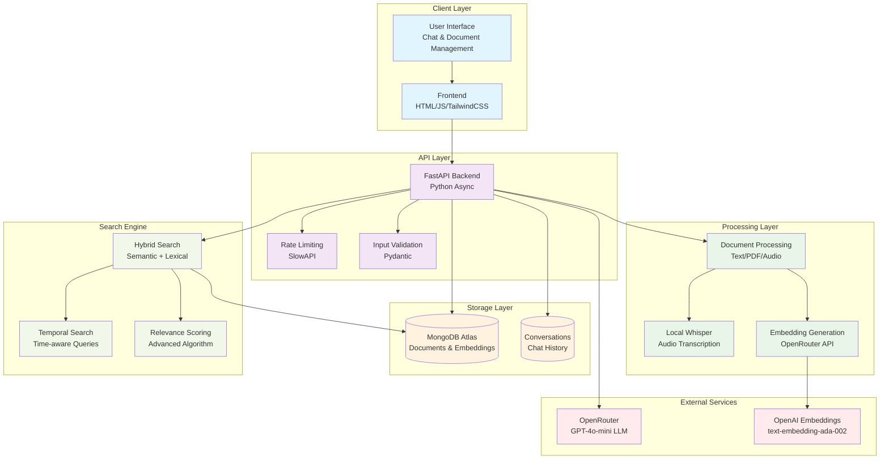
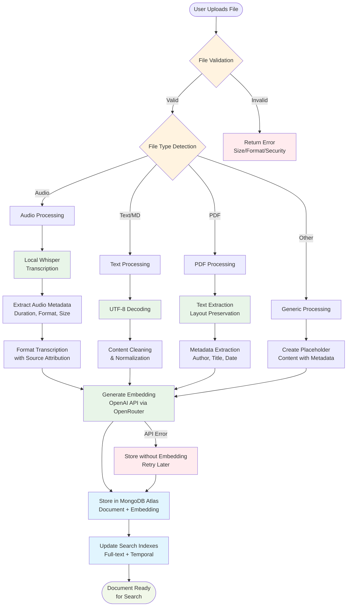
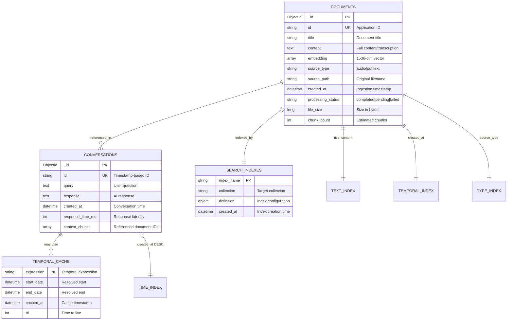
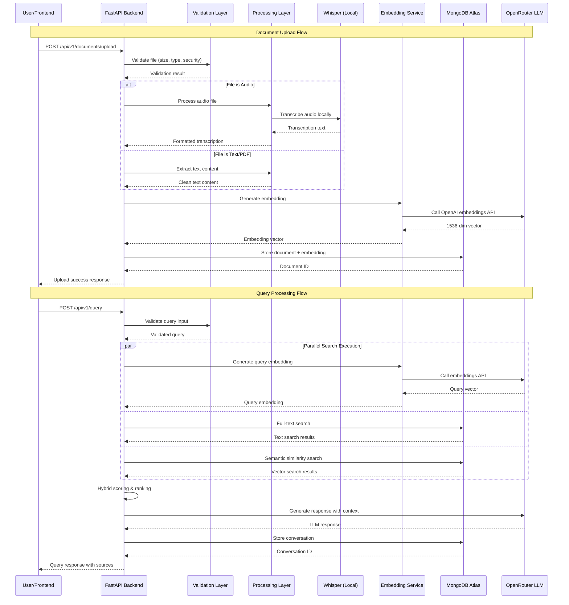
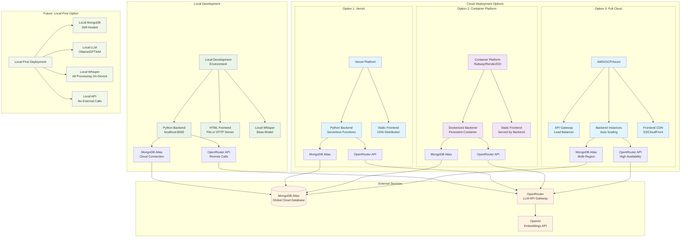

# Second Brain AI Companion - System Architecture Diagrams

## 1. High-Level System Architecture



## 2. Data Ingestion Pipeline



## 3. Hybrid Search Architecture

```mermaid
flowchart TD
    QUERY[User Query<br/>"What did I learn about ML last week?"] --> PARSE
    
    PARSE[Query Analysis] --> TEMPORAL{Temporal<br/>Expressions?}
    PARSE --> EMBED_Q[Generate Query<br/>Embedding]
    PARSE --> WORDS[Extract Keywords<br/>Filter Stop Words]
    
    TEMPORAL -->|Yes| TIME_PARSE[Parse Temporal<br/>"last week" → Date Range]
    TEMPORAL -->|No| SEARCH_PARALLEL
    TIME_PARSE --> TIME_FILTER[Apply Temporal Filter<br/>created_at: $gte, $lte]
    TIME_FILTER --> SEARCH_PARALLEL
    
    SEARCH_PARALLEL[Parallel Search Execution]
    
    EMBED_Q --> SEM_SEARCH[Semantic Search<br/>Cosine Similarity]
    WORDS --> LEX_SEARCH[Lexical Search<br/>MongoDB Full-text]
    
    SEM_SEARCH --> SEM_RESULTS[(Semantic Results<br/>similarity scores)]
    LEX_SEARCH --> LEX_RESULTS[(Lexical Results<br/>text scores)]
    
    SEM_RESULTS --> FUSION
    LEX_RESULTS --> FUSION
    
    FUSION[Result Fusion & Scoring] --> SCORE_CALC
    
    SCORE_CALC[Advanced Relevance Calculation] --> COMPONENTS
    
    COMPONENTS --> EXACT[Exact Phrase Matching<br/>0-80 points]
    COMPONENTS --> WORD[Word Coverage Analysis<br/>0-40 points with penalties]
    COMPONENTS --> SEMANTIC[Semantic Similarity Boost<br/>0-40 points]
    COMPONENTS --> CONTEXT[Context Relevance Check<br/>Content vs Filename]
    
    EXACT --> FINAL_SCORE
    WORD --> FINAL_SCORE
    SEMANTIC --> FINAL_SCORE
    CONTEXT --> FINAL_SCORE
    
    FINAL_SCORE[Normalize Score<br/>final_score / 150.0] --> THRESHOLD{Score > 15%?}
    
    THRESHOLD -->|Yes| INCLUDE[Include in Results]
    THRESHOLD -->|No| EXCLUDE[Exclude from Results]
    
    INCLUDE --> SORT[Sort by Relevance<br/>Descending]
    SORT --> TOP_K[Return Top 5 Results]
    
    TOP_K --> LLM[Send to LLM<br/>with Context]
    LLM --> RESPONSE[Generate Response<br/>with Source Attribution]
    
    %% Styling
    classDef query fill:#e1f5fe
    classDef process fill:#e8f5e8
    classDef search fill:#f3e5f5
    classDef scoring fill:#fff3e0
    classDef decision fill:#ffebee
    classDef result fill:#f1f8e9
    
    class QUERY query
    class PARSE,EMBED_Q,WORDS,TIME_PARSE,FUSION,SCORE_CALC process
    class SEM_SEARCH,LEX_SEARCH search
    class EXACT,WORD,SEMANTIC,CONTEXT,FINAL_SCORE scoring
    class TEMPORAL,THRESHOLD decision
    class TOP_K,LLM,RESPONSE result
```

## 4. Temporal Query Processing

```mermaid
flowchart TD
    INPUT[User Query<br/>"Show me documents from last month"] --> EXTRACT
    
    EXTRACT[Extract Temporal Expressions] --> PATTERNS
    
    PATTERNS[Pattern Matching] --> REL{Relative Time?}
    PATTERNS --> ABS{Absolute Time?}
    PATTERNS --> CTX{Context Dependent?}
    
    REL -->|"last week"| REL_CALC[Calculate Relative Date<br/>now - 7 days → range]
    REL -->|"yesterday"| REL_CALC
    REL -->|"this month"| REL_CALC
    
    ABS -->|"March 2024"| ABS_CALC[Parse Absolute Date<br/>2024-03-01 → 2024-03-31]
    ABS -->|"January 15th"| ABS_CALC
    
    CTX -->|"before meeting"| CTX_RESOLVE[Context Resolution<br/>Find reference event]
    
    REL_CALC --> DATE_RANGE[Create Date Range<br/>start_date, end_date]
    ABS_CALC --> DATE_RANGE
    CTX_RESOLVE --> DATE_RANGE
    
    DATE_RANGE --> MONGO_FILTER
    
    MONGO_FILTER[Apply MongoDB Filter<br/>created_at: {$gte: start, $lte: end}] --> TEMP_RESULTS
    
    TEMP_RESULTS[(Temporally Filtered<br/>Documents)] --> RELEVANCE
    
    RELEVANCE[Calculate Temporal Relevance] --> IN_RANGE{Document in<br/>Time Range?}
    
    IN_RANGE -->|Yes| HIGH_REL[High Relevance Score<br/>0.8 - 1.0]
    IN_RANGE -->|No| PROXIMITY[Calculate Proximity<br/>Exponential Decay]
    
    PROXIMITY --> LOW_REL[Lower Relevance Score<br/>0.1 - 0.5]
    
    HIGH_REL --> BOOST
    LOW_REL --> BOOST
    
    BOOST[Apply Temporal Boost<br/>final_score *= 1.1] --> FINAL_RESULTS
    
    FINAL_RESULTS[Temporally Ranked<br/>Search Results] --> TIMELINE
    
    TIMELINE[Present in Timeline<br/>Chronological Order] --> USER
    
    USER[User Sees Results<br/>with Temporal Context]
    
    %% Examples
    subgraph "Examples"
        EX1["last week" → 2024-01-01 to 2024-01-07]
        EX2["March 2024" → 2024-03-01 to 2024-03-31]
        EX3["before deadline" → Context lookup]
    end
    
    %% Styling
    classDef input fill:#e1f5fe
    classDef process fill:#e8f5e8
    classDef decision fill:#fff3e0
    classDef calculation fill:#f3e5f5
    classDef result fill:#f1f8e9
    classDef example fill:#f9f9f9
    
    class INPUT input
    class EXTRACT,MONGO_FILTER,RELEVANCE,BOOST process
    class REL,ABS,CTX,IN_RANGE decision
    class REL_CALC,ABS_CALC,DATE_RANGE,HIGH_REL,LOW_REL calculation
    class FINAL_RESULTS,TIMELINE,USER result
    class EX1,EX2,EX3 example
```

## 5. Database Schema and Relationships



## 6. API Flow and Data Movement



## 7. Deployment Architecture Options



## 8. Security and Privacy Architecture

```mermaid
flowchart TD
    subgraph "Data Privacy Layers"
        INPUT[User Data Input] --> CLASSIFY{Data Classification}
        
        CLASSIFY -->|Sensitive Audio| LOCAL_PROC[Local Processing<br/>Whisper Transcription]
        CLASSIFY -->|Documents| CLOUD_PROC[Cloud Processing<br/>Embedding Generation]
        CLASSIFY -->|Queries| CLOUD_LLM[Cloud LLM<br/>Response Generation]
        
        LOCAL_PROC --> LOCAL_STORE[Local Temporary Storage<br/>Immediate Cleanup]
        CLOUD_PROC --> ENCRYPT[Encryption in Transit<br/>TLS 1.3]
        CLOUD_LLM --> ENCRYPT
        
        LOCAL_STORE --> SECURE_DELETE[Secure File Deletion<br/>After Processing]
        ENCRYPT --> CLOUD_STORE[Cloud Storage<br/>MongoDB Atlas]
    end
    
    subgraph "Access Control"
        USER[User Authentication] --> API_KEY[API Key Validation<br/>User-Controlled Keys]
        API_KEY --> RATE_LIMIT[Rate Limiting<br/>100 req/min]
        RATE_LIMIT --> INPUT_VAL[Input Validation<br/>File Size/Type/Content]
        INPUT_VAL --> SANITIZE[Data Sanitization<br/>XSS/Injection Prevention]
    end
    
    subgraph "Data Sovereignty"
        USER_CONTROL[User Data Control] --> OWN_KEYS[Own API Keys<br/>OpenRouter Account]
        USER_CONTROL --> DATA_EXPORT[Data Export<br/>Full MongoDB Access]
        USER_CONTROL --> DATA_DELETE[Data Deletion<br/>Right to be Forgotten]
        USER_CONTROL --> REGION_CHOICE[Region Selection<br/>MongoDB Atlas Regions]
    end
    
    subgraph "Security Measures"
        ENV_VARS[Environment Variables<br/>No Hardcoded Secrets] --> CORS[CORS Configuration<br/>Trusted Origins Only]
        CORS --> HTTPS[HTTPS Enforcement<br/>Production Deployment]
        HTTPS --> AUDIT[Audit Logging<br/>Access & Error Tracking]
        AUDIT --> MONITOR[Health Monitoring<br/>Anomaly Detection]
    end
    
    %% Privacy Trade-offs
    subgraph "Privacy Trade-offs"
        CLOUD_BENEFITS[Cloud Benefits<br/>• Multi-device sync<br/>• Automatic backups<br/>• Professional security]
        PRIVACY_CONCERNS[Privacy Considerations<br/>• Data in cloud<br/>• API calls logged<br/>• Vendor dependencies]
        
        CLOUD_BENEFITS -.->|vs| PRIVACY_CONCERNS
    end
    
    %% Future Local-First
    subgraph "Future: Local-First"
        LOCAL_DEPLOY[Local Deployment] --> LOCAL_DB[Local MongoDB<br/>No Cloud Storage]
        LOCAL_DEPLOY --> LOCAL_LLM[Local LLM<br/>Ollama/GPT4All]
        LOCAL_DEPLOY --> OFFLINE[Offline Capable<br/>No Internet Required]
        LOCAL_DEPLOY --> FULL_PRIVACY[Complete Privacy<br/>No Data Leaves Device]
    end
    
    %% Styling
    classDef privacy fill:#e8f5e8
    classDef security fill:#e1f5fe
    classDef control fill:#f3e5f5
    classDef tradeoff fill:#fff3e0
    classDef future fill:#f1f8e9
    
    class LOCAL_PROC,SECURE_DELETE,CLOUD_STORE privacy
    class API_KEY,RATE_LIMIT,INPUT_VAL,SANITIZE,ENV_VARS,CORS,HTTPS security
    class USER_CONTROL,OWN_KEYS,DATA_EXPORT,DATA_DELETE control
    class CLOUD_BENEFITS,PRIVACY_CONCERNS tradeoff
    class LOCAL_DEPLOY,LOCAL_DB,LOCAL_LLM,OFFLINE,FULL_PRIVACY future
```



These Mermaid diagrams provide comprehensive visual documentation of the Second Brain AI Companion system architecture, covering:

1. **High-Level Architecture** - Overall system components and relationships
2. **Data Ingestion Pipeline** - Step-by-step file processing workflow
3. **Hybrid Search Architecture** - Advanced search and relevance scoring
4. **Temporal Query Processing** - Time-aware query handling
5. **Database Schema** - Data models and relationships
6. **API Flow** - Sequence diagrams for key operations
7. **Deployment Options** - Various deployment architectures
8. **Security & Privacy** - Data protection and privacy measures

Each diagram is based on the actual working implementation and can be rendered in any Mermaid-compatible viewer or documentation system.